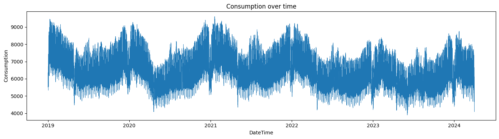
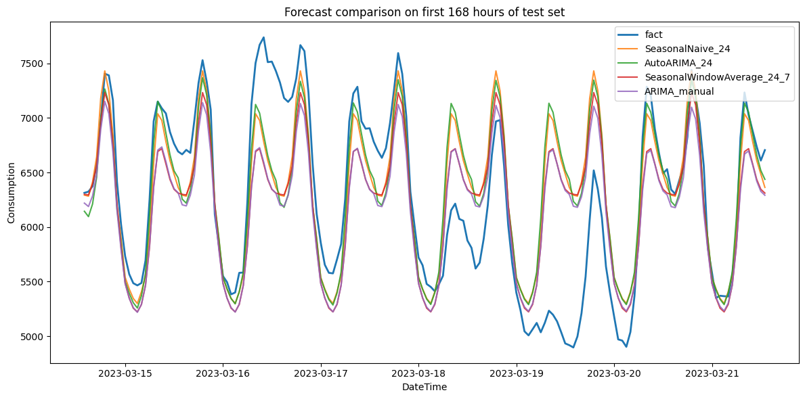
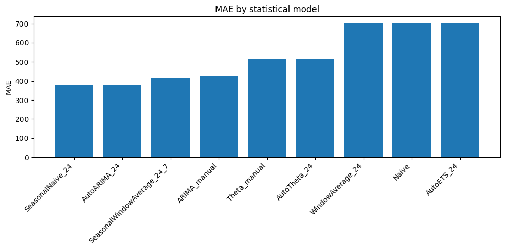
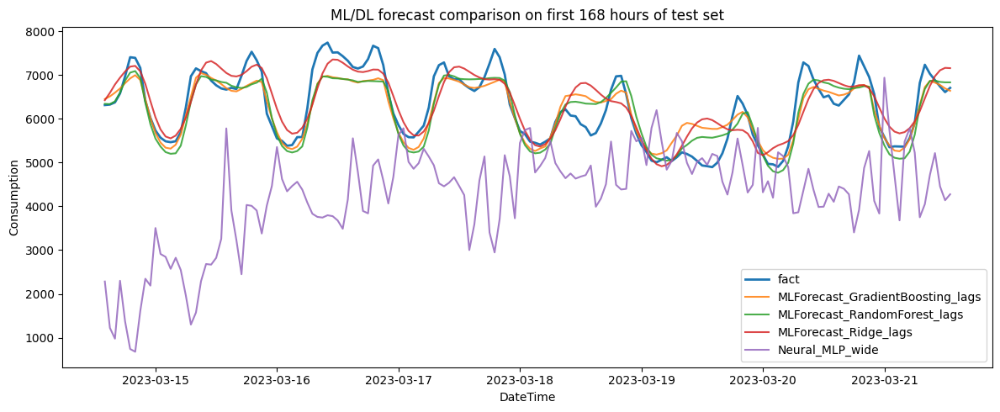
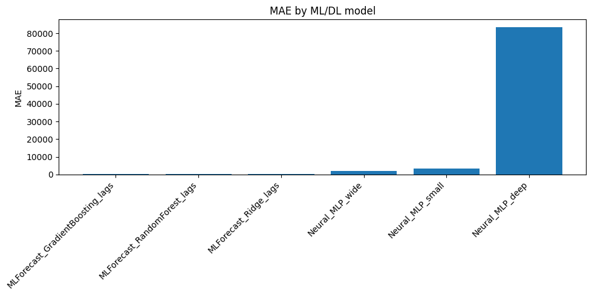
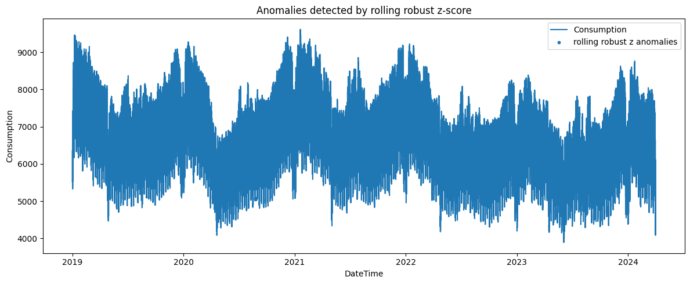
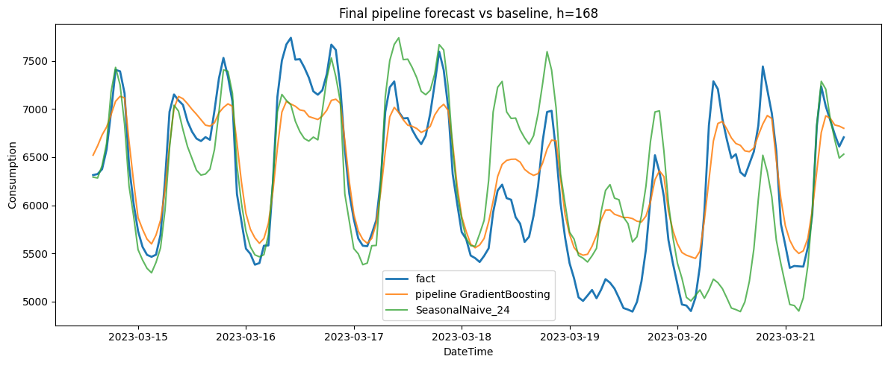
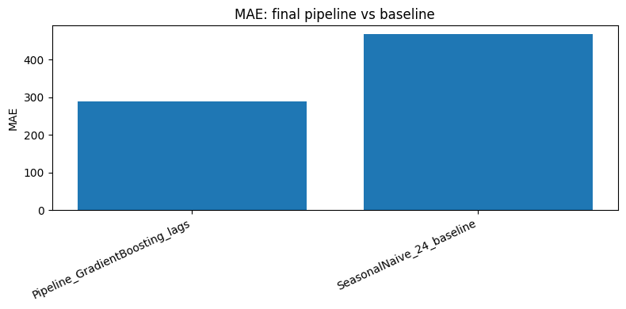

# Отчёт об исследовании временного ряда Electricity

## 1. Описание временного ряда

В работе исследуется временной ряд потребления электроэнергии Consumption из набора данных Electricity. Временная метка ряда — DateTime. Данные имеют почасовую дискретность и охватывают период с 2019-01-01 00:00:00 по 2024-03-31 23:00:00 после приведения к регулярной временной сетке.

Целевая переменная — Consumption, то есть потребление электроэнергии. Дополнительно в исходном наборе данных присутствуют признаки, связанные с производством электроэнергии по источникам: Production, Nuclear, Wind, Hydroelectric, Oil and Gas, Coal, Solar, Biomass. Основная задача проекта — прогнозирование временного ряда потребления.

После подготовки данных временной ряд был приведён к регулярной почасовой сетке. Были обнаружены и обработаны особенности временной оси: 9 дубликатов временных меток и 6 пропущенных часов. Итоговый подготовленный набор данных содержит 46008 наблюдений.

Основные статистики целевого ряда Consumption:

| Показатель | Значение |
| Количество наблюдений | 46008 |
| Среднее значение | 6587.76 |
| Стандартное отклонение | 1043.57 |
| Минимум | 3889.00 |
| 25% квантиль | 5773.00 |
| Медиана | 6552.00 |
| 75% квантиль | 7321.00 |
| Максимум | 9615.00 |

Для дальнейшего моделирования данные были разделены хронологически:

| Выборка | Период | Размер |
| Train | 2019-01-01 00:00:00 — 2023-03-14 13:00:00 | 36806 |
| Test | 2023-03-14 14:00:00 — 2024-03-31 23:00:00 | 9202 |

Разбиение выполнялось без перемешивания, так как важно было сохранить временной порядок наблюдений и не допустить утечки будущей информации в обучение.

## 2. Постановка задачи

Цель работы — провести полный цикл анализа и прогнозирования временного ряда потребления электроэнергии: от подготовки и EDA до сравнения статистических, ML- и DL-моделей, выбора итогового метода и построения пайплайна прогнозирования.

Основной является задача офлайн-прогнозирования временного ряда, то есть модель обучается на исторических данных и затем строит прогноз на будущий горизонт, что необходимо для планирования нагрузки, анализа потребления и предварительной оценки будущих значений ряда.

В качестве основного тестового горизонта для сравнения моделей использовались первые 168 часов тестовой выборки, то есть прогноз на одну неделю вперёд. Такой горизонт выбран потому, что ряд почасовой, а 168 = 24 × 7 позволяет проверить способность моделей учитывать не только суточную, но и недельную структуру потребления.

Для оценки качества использовались следующие метрики:

- MAE — средняя абсолютная ошибка в исходных единицах ряда;
- RMSE — корень из средней квадратичной ошибки, чувствительный к крупным ошибкам;
- sMAPE — симметричная процентная ошибка;
- MASE — масштабированная ошибка относительно сезонного наивного подхода.

Основной практический критерий — снижение ошибки прогноза относительно сезонного бейзлайна.

## 3. EDA временного ряда

На этапе предварительного анализа были изучены структура данных, временная ось, пропуски, дубликаты, распределение целевой переменной, сезонность и потенциальные аномалии.

По графикам и агрегированным статистикам выявлены следующие особенности ряда:

- ряд имеет выраженную суточную сезонность;
- потребление заметно зависит от часа суток;
- присутствует недельная структура, связанная с различием рабочих и выходных дней;
- наблюдаются изменения уровня ряда на отдельных временных участках;
- ряд не является полностью стационарным, так как содержит сезонные компоненты и меняющийся уровень;
- для прогнозирования целесообразно использовать лаговые признаки 24, 48, 168, а также календарные признаки.

Средние значения по часам суток показывают, что минимальное потребление наблюдается ночью и ранним утром, а более высокие значения — в дневные и вечерние часы. Например, среднее потребление около 03:00 составляет примерно 5485.80, а около 20:00 — примерно 7344.97.

На этапе первичного анализа аномалий использовался сезонный остаток и robust z-score. Метод выявил 90 потенциально аномальных точек. Такие точки не удалялись автоматически, так как они могут отражать реальные необычные режимы потребления, но были сохранены для последующего анализа.

### Визуализация EDA

## 4. Задача №1. Подготовка данных и EDA

В первой задаче был выбран и подготовлен набор данных Electricity. Данные были загружены в pandas, временная метка DateTime была преобразована к типу datetime, после чего ряд был отсортирован и приведён к регулярной почасовой сетке.

Дополнительно были сформированы календарные признаки: час суток, день недели, месяц, год и признак выходного дня. Эти признаки были добавлены, потому что EDA показал выраженную зависимость потребления от календарной структуры.

Для первичного бейзлайна были проверены две сезонные наивные модели:

| Модель | MAE | RMSE | sMAPE, % | Горизонт оценки |
| SeasonalNaive_24h | 407.54 | 585.48 | 6.83 | 9202 |
| SeasonalNaive_168h | 343.83 | 512.09 | 5.62 | 9202 |

Лучше сработал недельный сезонный наивный прогноз SeasonalNaive_168h, так как он учитывает повторяемость поведения по аналогичному часу предыдущей недели, что подтверждает наличие недельной структуры в ряде.

### Выводы по задаче №1

В результате задачи №1 временной ряд Consumption был подготовлен для дальнейшего анализа и моделирования. Итоговый ряд содержит 46008 почасовых наблюдений. Тренировочная выборка содержит 36806 наблюдений, тестовая выборка — 9202 наблюдения. Были выявлены суточная и недельная сезонность, а также 90 потенциальных аномальных точек по robust z-score. Бейзлайн SeasonalNaive_168h показал MAE 343.83 на всей тестовой выборке, что подтвердило важность недельной сезонности.

## 5. Задача №2. Статистические методы прогнозирования

Во второй задаче изучался фреймворк StatsForecast и статистические методы прогнозирования временных рядов. Для корректной оценки использовались подготовленные train/test-выборки из задачи №1. Повторное разбиение данных не выполнялось.

Для моделей использовался формат StatsForecast: unique_id, ds, y. Для ускорения расчётов при статистическом сравнении использовался фрагмент обучающей выборки длиной 24 × 60 часов, а тестовый горизонт составлял 168 часов.

В сравнение были включены простые бейзлайны, ручные статистические модели и модели с автоматическим подбором параметров:

| Модель | Тип | Обоснование параметров |
| Naive | бейзлайн | Использует последнее наблюдение, нужен как минимальный ориентир качества. |
| SeasonalNaive_24 | бейзлайн / статистический | season_length=24, так как ряд почасовой и имеет суточную сезонность. |
| WindowAverage_24 | статистический | Среднее за последние 24 часа сглаживает краткосрочные колебания. |
| SeasonalWindowAverage_24_7 | статистический | Использует несколько прошлых суточных сезонов, учитывая повторяемость по часу суток. |
| ARIMA_manual | статистический, ручной | Ручная ARIMA используется для проверки классического авторегрессионного подхода. |
| Theta_manual | статистический, ручной | Theta-модель проверяет трендово-сезонную структуру без сложных признаков. |
| AutoETS_24 | статистический, авто | Автоматический ETS подбирает экспоненциальное сглаживание с учётом сезонности 24. |
| AutoTheta_24 | статистический, авто | Автоматическая Theta-модель с сезонностью 24. |
| AutoARIMA_24 | статистический, авто | Автоматический подбор ARIMA-параметров с суточной сезонностью. |

### Сравнение статистических моделей на тестовом горизонте 168 часов

| Модель | MAE | RMSE | sMAPE, % | MASE |
| SeasonalNaive_24 | 377.52 | 539.29 | 6.06 | 0.94 |
| AutoARIMA_24 | 378.52 | 545.50 | 6.09 | 0.95 |
| SeasonalWindowAverage_24_7 | 414.93 | 537.53 | 6.64 | 1.04 |
| ARIMA_manual | 427.23 | 539.39 | 6.83 | 1.07 |
| Theta_manual | 515.12 | 610.43 | 8.34 | 1.29 |
| AutoTheta_24 | 515.12 | 610.43 | 8.34 | 1.29 |
| WindowAverage_24 | 701.29 | 798.54 | 11.26 | 1.75 |
| Naive | 703.10 | 802.13 | 11.29 | 1.76 |
| AutoETS_24 | 703.10 | 802.13 | 11.29 | 1.76 |

Лучшее качество на финальном горизонте показала модель SeasonalNaive_24: MAE 377.52, RMSE 539.29, sMAPE 6.06%, MASE 0.94. Модель AutoARIMA_24 оказалась очень близкой по качеству: MAE 378.52. Это означает, что для данного горизонта простая суточная сезонность объясняет значительную часть поведения ряда, а более сложная AutoARIMA_24 не даёт существенного улучшения.

### Бектестинг статистических моделей

Для проверки устойчивости результатов был проведён бектестинг на нескольких временных окнах обучающей выборки. Лучший результат в бектестинге показала модель SeasonalWindowAverage_24_7: MAE 435.71, RMSE 614.12, sMAPE 7.28%, MASE 1.09. Это говорит о том, что усреднение нескольких прошлых суточных сезонов может быть устойчивее на разных участках истории, хотя на финальном тестовом горизонте лучшей оказалась SeasonalNaive_24.

| Модель | MAE | RMSE | sMAPE, % | MASE |
| SeasonalWindowAverage_24_7 | 435.71 | 614.12 | 7.28 | 1.09 |
| ARIMA_manual | 493.57 | 761.18 | 8.98 | 1.23 |
| Theta_manual | 547.60 | 749.26 | 9.76 | 1.37 |
| AutoTheta_24 | 547.60 | 749.26 | 9.76 | 1.37 |
| SeasonalNaive_24 | 593.88 | 744.74 | 10.06 | 1.48 |
| WindowAverage_24 | 690.57 | 792.96 | 11.64 | 1.73 |
| Naive | 693.89 | 857.23 | 11.77 | 1.73 |
| AutoETS_24 | 693.89 | 857.23 | 11.77 | 1.73 |

### Вероятностный прогноз и анализ остатков

Для оценки неопределённости был построен вероятностный прогноз с интервалами 80% и 95% для модели SeasonalNaive_24. Интервал 95% шире интервала 80%, поэтому он показывает более широкий диапазон возможных будущих значений. Такой подход нужен для оценки не только точечного прогноза, но и возможной зоны ошибки.

Анализ остатков показал, что даже у лучших статистических моделей сохраняется автокорреляция на лаге 24. Например, у SeasonalNaive_24 residual ACF на лаге 24 равен 0.309, а p-value теста Ljung-Box имеет крайне малое значение. Это означает, что остатки не являются полностью случайными, и в ряде остаётся структура, которую статистические модели объясняют не полностью.

### Визуализация статистических моделей

### Выводы по задаче №2

В задаче №2 было выполнено сравнение более чем пяти статистических методов. На финальном горизонте 168 часов лучший результат показала модель SeasonalNaive_24 с MAE 377.52 и sMAPE 6.06%. AutoARIMA_24 показала близкое качество с MAE 378.52, но не дала существенного выигрыша относительно простого сезонного бейзлайна. Бектестинг показал, что на разных временных окнах устойчивой может быть SeasonalWindowAverage_24_7 с MAE 435.71. Вероятностный прогноз и анализ остатков показали, что статистические модели полезны, но не полностью объясняют структуру ряда.

## 6. Задача №3. Методы машинного обучения, глубокого обучения и анализ аномалий

В третьей задаче временной ряд был преобразован в задачу обучения с учителем. Для этого использовался feature engineering для временных рядов: лаги, скользящие статистики и календарные признаки. Такой подход соответствует логике mlforecast, где модель машинного обучения получает табличное представление временного ряда.

Использованные признаки:

| Группа признаков | Признаки | Обоснование |
| Краткосрочные лаги | lag_1, lag_2, lag_3 | Учитывают ближайшую динамику ряда |
| Суточные лаги | lag_24, lag_48 | Учитывают повторяемость по часу суток |
| Недельный лаг | lag_168 | Учитывает недельную сезонность|
| Скользящие признаки | rolling_mean_24, rolling_std_24, rolling_mean_168, rolling_std_168 | Описывают локальный уровень и изменчивость за сутки и неделю|
| Календарные признаки | hour, dayofweek, month, is_weekend | Учитывают календарную структуру потребления. |
| Циклические признаки | sin_hour, cos_hour | Корректно кодируют цикличность часа суток. |

После формирования признаков обучающая таблица содержала 36638 строк и 16 признаков.

### Сравнение ML- и DL-моделей

| Модель | Группа | MAE | RMSE | sMAPE, % | MASE | Комментарий |
| MLForecast_GradientBoosting_lags | ML | 278.61 | 370.61 | 4.44 | 0.60 | Лучшее качество по MAE и sMAPE; хорошо использует нелинейные зависимости лаговых и календарных признаков|
| MLForecast_RandomForest_lags | ML | 291.51 | 358.93 | 4.66 | 0.62 | Близок к лучшей модели, имеет меньший RMSE, то есть лучше ограничивает крупные ошибки|
| MLForecast_Ridge_lags | ML | 351.42 | 442.21 | 5.59 | 0.75 | Линейная модель хуже учитывает нелинейности, но лучше сезонного масштаба, так как MASE < 1|
| Neural_MLP_wide | DL | 2093.67 | 2581.37 | 41.56 | 4.48 | Нейросетевая модель без глубокой настройки показала слабое качество|
| Neural_MLP_small | DL | 3210.97 | 3538.70 | 70.96 | 6.87 | Упрощённая MLP-модель не смогла устойчиво восстановить структуру ряда|
| Neural_MLP_deep | DL | 83579.42 | 507704.12 | 47.48 | 178.75 | Глубокая MLP-модель оказалась нестабильной для данной настройки. |

Параметры ML-моделей выбирались как компромисс между качеством и скоростью. Для GradientBoostingRegressor использовалось ограниченное число деревьев и небольшая глубина, чтобы снизить риск переобучения и сохранить интерпретируемость. Для RandomForestRegressor ансамбль деревьев позволял проверять устойчивость нелинейной модели. Ridge использовался как регуляризованная линейная модель, то есть более простой ориентир среди ML-методов.

DL-модели были представлены вариантами MLP с разной архитектурой: small, wide и deep. Они нужны для проверки подхода глубокого обучения, однако результаты показали, что без более тщательной настройки архитектуры, нормализации, числа эпох и стратегии обучения нейросетевые модели уступают классическим ML-моделям на сформированных признаках.

### Анализ аномалий

В задаче №3 были применены три метода выявления аномалий:

| Метод | Найдено аномалий | Доля, % | Комментарий |
| IQR | 0 | 0.000 | Глобальный метод не нашёл грубых выбросов по распределению|
| Rolling robust z-score | 3 | 0.0065 | Находит редкие локальные отклонения с учётом временного контекста |
| IsolationForest | 458 | 0.9955 | Находит около 1% точек из-за заданной доли contamination и учитывает многомерные признаки |

Наиболее интерпретируемым для данного временного ряда оказался rolling robust z-score, так как он учитывает локальное поведение ряда и не помечает слишком много точек как аномальные.

### Визуализация ML/DL-моделей и аномалий

### Выводы по задаче №3

В задаче №3 было выполнено сравнение трёх ML-моделей и трёх DL-моделей. Лучший результат показала MLForecast_GradientBoosting_lags: MAE 278.61, RMSE 370.61, sMAPE 4.44%, MASE 0.60. Это лучше результатов статистических моделей из задачи №2 и показывает, что лаговые, скользящие и календарные признаки существенно улучшают прогноз. RandomForest также показал сильный результат: MAE 291.51. Нейросетевые MLP-модели в текущей настройке оказались существенно хуже, поэтому для итогового пайплайна была выбрана модель градиентного бустинга.

## 7. Таблица выбора методов анализа временного ряда

Итоговая таблица объединяет бейзлайн, статистические модели, ML- и DL-подходы, рассмотренные в задачах №2 и №3.

| Группа | Метод | Основные параметры | MAE | RMSE | sMAPE, % | MASE | Итоговый комментарий |
| Бейзлайн | SeasonalNaive_24 | season_length=24 | 377.52 | 539.29 | 6.06 | 0.94 | Сильный простой бейзлайн для суточной сезонности |
| Статистический | Naive | последнее значение | 703.10 | 802.13 | 11.29 | 1.76 | Слабый ориентир, не учитывает сезонность |
| Статистический | WindowAverage_24 | окно 24 часа | 701.29 | 798.54 | 11.26 | 1.75 | Сглаживание без сезонной структуры оказалось слабым. |
| Статистический | SeasonalWindowAverage_24_7 | 7 суточных сезонов | 414.93 | 537.53 | 6.64 | 1.04 | Устойчивый метод, хорошо проявился в бектестинге. |
| Статистический | ARIMA_manual | ручная ARIMA | 427.23 | 539.39 | 6.83 | 1.07 | Классический подход, но хуже суточного бейзлайна. |
| Статистический | Theta_manual | ручная Theta | 515.12 | 610.43 | 8.34 | 1.29 | Хуже моделей, явно учитывающих суточную сезонность. |
| Статистический | AutoETS_24 | автоматический ETS, сезонность 24 | 703.10 | 802.13 | 11.29 | 1.76 | В данной настройке не улучшил простой прогноз. |
| Статистический | AutoTheta_24 | автоматическая Theta, сезонность 24 | 515.12 | 610.43 | 8.34 | 1.29 | Повторяет качество Theta_manual. |
| Статистический | AutoARIMA_24 | автоматическая ARIMA, сезонность 24 | 378.52 | 545.50 | 6.09 | 0.95 | Почти равна SeasonalNaive_24, но сложнее. |
| ML | MLForecast_Ridge_lags | лаги, rolling, calendar, Ridge | 351.42 | 442.21 | 5.59 | 0.75 | Простой ML-подход уже лучше статистических моделей. |
| ML | MLForecast_RandomForest_lags | лаги, rolling, calendar, RandomForest | 291.51 | 358.93 | 4.66 | 0.62 | Сильная нелинейная модель, близкая к лучшей. |
| ML | MLForecast_GradientBoosting_lags | лаги, rolling, calendar, GradientBoosting | 278.61 | 370.61 | 4.44 | 0.60 | Лучший результат среди ML/DL, выбран для пайплайна. |
| DL | Neural_MLP_small | MLP с небольшой архитектурой | 3210.97 | 3538.70 | 70.96 | 6.87 | Недостаточно устойчива без дополнительной настройки. |
| DL | Neural_MLP_wide | широкая MLP | 2093.67 | 2581.37 | 41.56 | 4.48 | Лучшая среди MLP, но существенно хуже ML-моделей. |
| DL | Neural_MLP_deep | глубокая MLP | 83579.42 | 507704.12 | 47.48 | 178.75 | Нестабильна в текущей настройке |

По результатам таблицы для итогового пайплайна выбран GradientBoostingRegressor, так как он показал минимальную MAE и sMAPE среди всех рассмотренных ML/DL-моделей и заметно улучшил качество относительно статистических подходов.

## 8. Анализ надёжности и производительности алгоритмов

Надёжность результатов оценивалась несколькими способами:

1. *Отложенная тестовая выборка.* Все модели сравнивались на будущей части ряда, которая не использовалась при обучении.
2. *Бектестинг.* Для статистических моделей выполнялась проверка на нескольких временных окнах. Это позволило оценить устойчивость качества, а не только результат на одном финальном горизонте.
3. *Вероятностный прогноз.* Для SeasonalNaive_24 были построены интервалы 80% и 95%, что позволило оценить неопределённость будущих значений.
4. *Анализ остатков.* Остатки статистических моделей проверялись на среднее смещение и автокорреляцию. Было показано, что в остатках сохраняется сезонная структура, поэтому задача не является полностью решённой простыми статистическими моделями.
5. *Статистическое тестирование итогового пайплайна.* Для финального пайплайна использовались t-test среднего остатка, Ljung-Box test и Wilcoxon test.
6. *Тестирование производительности.* Для итогового пайплайна измерялись время обучения и время прогнозирования.

Ключевой результат по производительности итогового пайплайна:

| Показатель | Значение |
| Время обучения | 3.61 сек |
| Время прогноза на 168 часов | 0.18 сек |
| Среднее время на один шаг прогноза | 1.05 мс |
| Количество строк train после feature engineering | 36638 |
| Количество признаков | 16 |
| Горизонт прогноза | 168 часов |

Такие значения показывают, что пайплайн подходит для офлайн-прогнозирования: обучение занимает несколько секунд, а построение недельного прогноза выполняется практически мгновенно.

## 9. Задача №4. Итоговый пайплайн решения задачи прогнозирования

Итоговый пайплайн строится на модели GradientBoostingRegressor, обученной на лаговых, скользящих и календарных признаках. Пайплайн использует подготовленные train/test-выборки из задачи №1.

Состав пайплайна:

1. загрузка подготовленных train/test-данных;
2. формирование признаков временного ряда;
3. обучение GradientBoostingRegressor;
4. рекурсивное прогнозирование на горизонт 168 часов;
5. сравнение с SeasonalNaive_24_baseline;
6. расчёт метрик качества;
7. статистическое тестирование;
8. тестирование производительности;
9. визуализация прогноза и сохранение результатов.

### Обоснование настройки пайплайна

Лаги 1, 2, 3 используются для учёта краткосрочной динамики. Лаги 24 и 48 отражают суточную сезонность. Лаг 168 добавлен для учёта недельной сезонности. Скользящие средние и стандартные отклонения за 24 и 168 часов описывают локальный уровень и изменчивость ряда. Календарные признаки учитывают час суток, день недели, месяц и выходные дни.

Настройка модели GradientBoostingRegressor выбрана как компромисс между качеством прогноза и скоростью работы пайплайна. В модели используется n_estimators=50, чтобы ограничить количество деревьев и сохранить быстрое обучение. Параметр learning_rate=0.06 задаёт умеренный шаг обучения, снижая риск слишком резкой подгонки под обучающую выборку. Параметр max_depth=3 ограничивает глубину отдельных деревьев, что уменьшает риск переобучения и делает модель более устойчивой. Параметр random_state=42 фиксирует случайность и обеспечивает воспроизводимость результатов.

Горизонт прогноза H=168 выбран как недельный прогноз для почасового временного ряда: 168 часов соответствуют 7 суткам.

### Тестирование качества итогового пайплайна

| Модель | MAE | RMSE | sMAPE, % | MASE | n |
| Pipeline_GradientBoosting_lags | 289.13 | 362.37 | 4.70 | 0.71 | 168 |
| SeasonalNaive_24_baseline | 467.57 | 627.44 | 7.60 | 1.15 | 168 |

Итоговый пайплайн показал более высокое качество, чем сезонный наивный бейзлайн. MAE снизилась с 467.57 до 289.13, RMSE — с 627.44 до 362.37, sMAPE — с 7.60% до 4.70%. Значение MASE у пайплайна равно 0.71, то есть модель лучше сезонного наивного прогноза.

### Статистическое тестирование пайплайна

| Тест | Статистика | p-value | Интерпретация |
| residual_mean_ttest | -3.1713 | 0.001806 | Средний остаток статистически значимо отличается от нуля; есть небольшое смещение. |
| ljung_box_lag_24 | 451.8308 | 1.58e-80 | В остатках сохраняется автокорреляция на суточном лаге. |
| wilcoxon_abs_error_vs_seasonal_naive | 4139.0000 | 1.39e-06 | Ошибки пайплайна статистически значимо меньше ошибок сезонного бейзлайна. |

Статистическое тестирование подтверждает преимущество итогового пайплайна над бейзлайном. При этом наличие автокорреляции в остатках показывает, что модель можно улучшать дальше, например за счёт дополнительных признаков, более сложных моделей или отдельного моделирования сезонности.

### Визуализация итогового пайплайна

### Выводы по задаче №4

В задаче №4 был подготовлен итоговый пайплайн прогнозирования временного ряда. Он основан на модели GradientBoostingRegressor и использует лаговые, скользящие и календарные признаки. На горизонте 168 часов итоговый пайплайн показал MAE 289.13, RMSE 362.37, sMAPE 4.70%, MASE 0.71, что лучше сезонного бейзлайна SeasonalNaive_24_baseline с MAE 467.57. Wilcoxon test подтвердил статистически значимое снижение абсолютных ошибок. Производительность пайплайна также приемлема: обучение заняло 3.61 секунды, прогноз на неделю — 0.18 секунды.

## 10. Общее заключение

В данной работе был проведён полный цикл исследования временного ряда потребления электроэнергии Consumption из набора данных Electricity. Цель исследования заключалась в подготовке данных, анализе структуры временного ряда, сравнении статистических, ML- и DL-методов прогнозирования, выборе итоговой модели и построении пайплайна прогнозирования.

На этапе подготовки данных временной ряд был приведён к регулярной почасовой сетке. Итоговый набор содержит 46008 наблюдений за период с 2019-01-01 00:00:00 по 2024-03-31 23:00:00. Тренировочная выборка содержит 36806 наблюдений, тестовая выборка — 9202. EDA показал выраженную суточную и недельную сезонность, а также наличие потенциальных аномальных точек. Первичный анализ аномалий с robust z-score выявил 90 потенциальных аномалий.

В статистической части было сравнено более пяти методов прогнозирования. Лучшей статистической моделью на горизонте 168 часов стала SeasonalNaive_24 с MAE 377.52 и sMAPE 6.06%. Модель AutoARIMA_24 показала очень близкий результат: MAE 378.52, но не дала существенного улучшения относительно простого суточного бейзлайна. Бектестинг показал, что SeasonalWindowAverage_24_7 может быть устойчивой на разных временных окнах, а вероятностный прогноз позволил оценить неопределённость будущих значений.

В разделе, посвящённом моделям машинного и глубокого обучения, было проведено сравнение трёх ML-моделей и трёх DL-моделей. Лучшее качество показала модель MLForecast_GradientBoosting_lags: MAE 278.61, RMSE 370.61, sMAPE 4.44%, MASE 0.60. Это лучше статистических моделей и показывает, что лаговые, скользящие и календарные признаки хорошо описывают структуру ряда. Нейросетевые MLP-модели в текущей настройке оказались менее устойчивыми и существенно уступили ML-моделям.

На основе результатов сравнения был построен итоговый пайплайн с моделью GradientBoostingRegressor. На тестовом горизонте 168 часов он показал MAE 289.13, RMSE 362.37, sMAPE 4.70%, MASE 0.71, в то время как сезонный наивный бейзлайн на том же горизонте показал MAE 467.57, RMSE 627.44, sMAPE 7.60%, MASE 1.15. Таким образом, итоговый пайплайн существенно улучшил качество прогноза относительно бейзлайна.

Статистическое тестирование подтвердило надёжность улучшения: Wilcoxon test показал p-value 1.39e-06, что указывает на статистически значимое снижение абсолютных ошибок итогового пайплайна по сравнению с сезонным бейзлайном. При этом t-test среднего остатка и Ljung-Box test показали, что в остатках сохраняются небольшое смещение и автокорреляция на суточном лаге. Это означает, что итоговое решение работает лучше бейзлайна, но ряд всё ещё содержит структуру, которую можно дополнительно моделировать.

Производительность итогового пайплайна является приемлемой для офлайн-прогнозирования: обучение заняло около 3.61 секунды, а построение рекурсивного прогноза на 168 часов — около 0.18 секунды. Следовательно, полученный пайплайн можно использовать как рабочее итоговое решение для прогнозирования потребления электроэнергии на недельный горизонт, а дальнейшие улучшения могут быть связаны с расширением признаков, дополнительной настройкой моделей и более глубоким анализом остатков.
